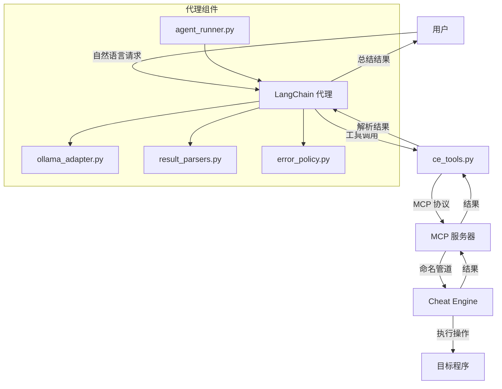

# MCP LangChain Agent (预案 C)

**将 LangChain 强大的代理能力与 Cheat Engine MCP Bridge 无缝集成。**

通过 LangChain 框架，将 AI 代理的推理能力与 Cheat Engine 的内存分析能力相结合，实现更智能、更自动化的内存分析和逆向工程工作流程。

[](#) [](https://python.org)

---

## 引入

在复杂的内存分析任务中，单纯的工具调用往往不足以解决问题。你需要一个能够理解上下文、规划步骤、执行复杂推理的智能代理。

**如果你可以让 AI 代理自主完成整个分析流程呢？**

> *"找到游戏的数据包解密函数，分析其算法并生成解密脚本。"*
> *"分析玩家数据结构，提取所有相关字段并生成结构定义。"*
> *"找到游戏的移动操作码，分析其工作原理并生成训练器代码。"*

**这正是此工具的作用。**

_- 停止手动调用工具，开始让 AI 代理自主完成复杂任务。_

---

## 你将获得：

| 之前（手动工具调用） | 之后（LangChain 代理） |
|----------------------|------------------------|
| 第1步：手动扫描值 | 第1步：AI 自主规划完整分析流程 |
| 第2步：手动设置断点 | 第2步：AI 自动执行所有必要工具调用 |
| 第3步：手动反汇编 | 第3步：AI 分析结果并生成最终解决方案 |
| 第4步：手动分析结构 | **完成。** |
| 第5步：手动编写脚本 | |

**你的 AI 代理现在可以：**
- 自主规划复杂任务的执行步骤
- 理解上下文，进行多步推理
- 自动调用所需的 Cheat Engine MCP 工具
- 分析结果并生成最终解决方案
- 在 LangChain 不可用时回退到内置执行循环

---

## 工作原理


---

## 安装

```bash
pip install -r requirements.txt
```

> [!NOTE]
> **依赖于 Cheat Engine MCP Bridge** - 确保已安装并运行主项目的 MCP 桥接

---

## 快速开始

### 1. 确保 Cheat Engine MCP Bridge 已运行
```
1. 在 CheatEngine 中启用 DBVM
2. 执行 ce_mcp_bridge.lua 脚本
3. 确认看到：`[MCP v11.4.0] Server started on \\.\pipe\CE_MCP_Bridge_v99`
```

### 2. 配置环境变量
```bash
# Ollama 服务器配置
export OLLAMA_URL=http://localhost:11434
export OLLAMA_MODEL=ollama

# 安全配置
# 允许破坏性操作（测试时短期开启，生产环境禁用）
export AGENT_ALLOW_DESTRUCTIVE=0
```

### 3. 运行 LangChain 代理
```bash
python agent_runner.py
```

### 4. 开始提问
```
"找到游戏的金币地址并分析其修改函数"
"分析玩家数据结构并提取所有相关字段"
"找到数据包解密函数并生成解密脚本"
```

---

## 核心组件

### 代理基础架构
| 组件 | 描述 |
|------|-------------|
| `ollama_adapter.py` | 与 Ollama HTTP API 的轻量适配器，提供模型访问 |
| `ce_tools.py` | 将现有 Cheat Engine 桥接封装为可注册给 agent 的工具 |
| `result_parsers.py` | pydantic 解析器，保证工具输出结构化 |
| `error_policy.py` | 生产级的重试与破坏性操作审批钩子 |
| `agent_runner.py` | 启动 agent 的入口，优先使用 LangChain；若不可用则回退到内置执行循环 |

### 工具集
| 工具类别 | 描述 |
|----------|-------------|
| 内存操作 | 读取内存、指针链解析、结构分析 |
| 扫描搜索 | AOB 扫描、值扫描、字符串搜索 |
| 反汇编分析 | 指令反汇编、函数分析、引用查找 |
| 断点调试 | 硬件断点设置、数据断点、断点管理 |
| DBVM 工具 | 物理地址转换、隐形监视 |
| 进程模块 | 进程信息、模块枚举、线程列表 |
| 脚本控制 | Lua 执行、自动汇编、连接验证 |

---

## 关键配置

### 安全配置
> [!CAUTION]
> **生产环境必须：**
> 
> 1. 替换 `require_destructive_approval` 中的审批逻辑为人工确认或集中策略引擎
> 2. 启用审计日志，记录所有工具调用和 LLM prompts
> 3. 设置 `AGENT_ALLOW_DESTRUCTIVE=0` 禁用破坏性操作

---

## 示例工作流

**分析玩家数据结构：**
```
你："分析游戏中的玩家数据结构"
AI："开始分析玩家数据结构..."
AI："1. 扫描玩家相关值..."
AI："2. 设置断点跟踪数据访问..."
AI："3. 反汇编相关函数..."
AI："4. 分析内存结构..."
AI："玩家数据结构分析完成："
AI："- 0x00: vtable (ptr)"
AI："- 0x08: health (float)"
AI："- 0x10: position (vector3)"
AI："- 0x20: inventory (ptr)"
```

**找到并分析解密函数：**
```
你："找到游戏的数据包解密函数并分析其算法"
AI："开始寻找数据包解密函数..."
AI："1. 扫描网络相关值..."
AI："2. 设置断点跟踪数据包处理..."
AI："3. 反汇编解密函数..."
AI："4. 分析算法逻辑..."
AI："解密函数分析完成："
AI："- 函数地址: 0x12345678"
AI："- 算法: AES-128-CBC"
AI："- 密钥位置: [[game.exe+0x1000]+0x20]"
AI："- 生成了解密脚本: decrypt_packet.py"
```

---

## 项目结构

```
LangChain Agent/
├── ollama_adapter.py      # Ollama API 适配器
├── ce_tools.py           # Cheat Engine 工具封装
├── result_parsers.py     # 结果解析器
├── error_policy.py       # 错误处理与安全策略
├── agent_runner.py       # 代理运行入口
└── requirements.txt      # 依赖配置
```

---

## 测试

项目包含基本的测试功能，确保代理能够正常工作：

### 运行测试
```bash
# 测试 Ollama 连接
python -c "from ollama_adapter import test_ollama_connection; test_ollama_connection()"

# 测试 Cheat Engine MCP 连接
python -c "from ce_tools import test_ce_connection; test_ce_connection()"

# 测试代理运行
python agent_runner.py --test
```

### 预期输出
```
✅ Ollama 连接测试通过
✅ Cheat Engine MCP 连接测试通过
✅ LangChain 代理初始化成功
✅ 内置执行循环测试通过
```

---

## 总结

MCP LangChain Agent 为 Cheat Engine MCP Bridge 增添了智能代理能力，使复杂的内存分析任务变得更加自动化和智能化。通过 LangChain 框架，AI 代理可以理解上下文、规划步骤、执行复杂推理，自主完成整个分析流程。

⚠️ 教育免责声明

此代码仅用于教育和研究目的。它的创建是为了展示 LangChain 代理与内存分析工具的集成能力。我不赞成将这些工具用于恶意黑客攻击、多人游戏作弊或违反服务条款。这是软件工程自动化的演示。

---

## 技术分析报告

### 1. 项目概述

MCP LangChain Agent 是一个智能代理系统，旨在将 LangChain 的推理能力与 Cheat Engine MCP Bridge 相结合，实现复杂内存分析任务的自动化。通过自然语言交互，用户可以让 AI 代理自主完成从问题分析到解决方案生成的整个流程。

**核心价值**：将通常需要手动执行的多步内存分析任务转变为 AI 代理的自主执行流程，显著提高分析效率和准确性。

### 2. 架构设计

项目采用多层架构设计，通过标准化的接口实现模块间的高效交互：

#### 2.1 架构层次

| 层次 | 组件 | 职责 | 通信方式 |
|------|------|------|----------|
| 顶层 | 用户 | 提供自然语言请求 | 自然语言 |
| 代理层 | LangChain 代理 | 理解请求，规划步骤，执行推理 | 工具调用 |
| 工具层 | ce_tools.py | 封装 Cheat Engine MCP 工具 | MCP 协议 |
| 服务层 | MCP 服务器 | 处理工具调用请求 | 命名管道 |
| 底层 | Cheat Engine | 执行实际的内存操作 | Lua API |

#### 2.2 数据流

1. 用户通过自然语言向 LangChain 代理提出请求
2. LangChain 代理理解请求，规划执行步骤
3. 代理调用 ce_tools.py 中封装的工具
4. ce_tools.py 通过 MCP 协议向 MCP 服务器发送请求
5. MCP 服务器通过命名管道将请求转发给 Cheat Engine
6. Cheat Engine 执行实际操作并返回结果
7. 结果通过反向路径返回给代理
8. 代理分析结果并生成最终解决方案
9. 代理将解决方案呈现给用户

### 3. 核心功能与实现

#### 3.1 代理系统

- **LangChain 集成**：优先使用 LangChain 框架提供的代理能力
- **回退机制**：在 LangChain 不可用时回退到内置执行循环
- **上下文管理**：维护任务执行的上下文信息
- **推理能力**：进行多步推理，规划复杂任务的执行步骤

#### 3.2 工具封装

- **Cheat Engine MCP 工具封装**：将现有 MCP 工具封装为 LangChain 可用的工具
- **结果解析**：使用 pydantic 解析器确保工具输出结构化
- **错误处理**：实现生产级的错误处理和重试机制
- **安全策略**：提供破坏性操作的审批机制

#### 3.3 Ollama 集成

- **轻量级适配器**：与 Ollama HTTP API 进行交互
- **模型配置**：支持通过环境变量配置模型参数
- **请求处理**：处理与 Ollama 服务器的通信

### 4. 技术实现亮点

#### 4.1 灵活的代理架构

- **双模式执行**：同时支持 LangChain 和内置执行循环
- **可扩展性**：模块化设计，便于添加新功能和集成其他模型
- **配置驱动**：通过环境变量和配置文件控制行为

#### 4.2 安全机制

- **破坏性操作审批**：对潜在危险操作进行审批控制
- **审计日志**：可扩展的日志处理，记录所有操作
- **环境隔离**：建议使用虚拟环境，避免依赖冲突

#### 4.3 错误处理

- **生产级重试**：实现智能重试机制，提高系统可靠性
- **错误分类**：对不同类型的错误采取不同的处理策略
- **优雅降级**：在遇到不可恢复错误时优雅降级

### 5. 部署与使用

#### 5.1 环境要求

- **操作系统**：Windows（依赖 Cheat Engine MCP Bridge）
- **Python**：3.10+
- **依赖**：
  - langchain（可选，优先使用）
  - ollama（通过 HTTP API）
  - pydantic
  - mcp（Cheat Engine MCP Bridge 依赖）

#### 5.2 安装步骤

1. **安装依赖**：
   ```bash
   pip install -r requirements.txt
   ```

2. **配置环境变量**：
   ```bash
   export OLLAMA_URL=http://localhost:11434
   export OLLAMA_MODEL=ollama
   export AGENT_ALLOW_DESTRUCTIVE=0
   ```

3. **启动 Cheat Engine MCP Bridge**：
   - 在 Cheat Engine 中启用 DBVM
   - 执行 ce_mcp_bridge.lua 脚本

4. **运行代理**：
   ```bash
   python agent_runner.py
   ```

### 6. 应用场景

- **复杂内存分析**：需要多步操作的内存分析任务
- **自动化逆向工程**：自动完成逆向工程的各个步骤
- **智能训练器开发**：分析游戏机制并生成训练器代码
- **安全审计**：自动检测程序中的安全漏洞
- **教育研究**：作为 AI 辅助内存分析的教学工具

### 7. 技术栈

| 类别 | 技术/工具 | 用途 | 来源 |
|------|-----------|------|------|
| 编程语言 | Python 3.10+ | 代理系统实现 | 所有组件 |
| 框架 | LangChain（可选） | 提供代理能力 | agent_runner.py |
| API | Ollama HTTP API | 提供 LLM 能力 | ollama_adapter.py |
| 数据验证 | Pydantic | 结果解析和验证 | result_parsers.py |
| 通信协议 | MCP（JSON-RPC over stdio） | 与 MCP 服务器通信 | ce_tools.py |
| 依赖管理 | pip | 安装依赖 | requirements.txt |

### 8. 结论

MCP LangChain Agent 是一个技术先进的智能代理系统，通过将 LangChain 的推理能力与 Cheat Engine MCP Bridge 相结合，创造了新的内存分析工作流程。它不仅显著提高了内存分析效率，还降低了技术门槛，使更多开发者和研究人员能够执行复杂的内存分析工作。

项目的架构设计清晰，技术实现精湛，功能丰富，使其成为逆向工程和内存分析领域的重要工具。它展示了如何将现代 AI 代理技术与传统系统工具相结合，创造具有革命性价值的解决方案。

**未来发展潜力**：
- 集成更多 LLM 提供商（如 OpenAI、Anthropic 等）
- 添加更多高级分析功能和工具
- 开发图形界面，进一步降低使用门槛
- 集成更多逆向工程工具，形成完整的分析生态系统

### 9. 声明

此工具仅用于教育和研究目的，不应用于恶意黑客攻击、多人游戏作弊或违反服务条款。用户在使用时应遵守相关法律法规和道德规范。
