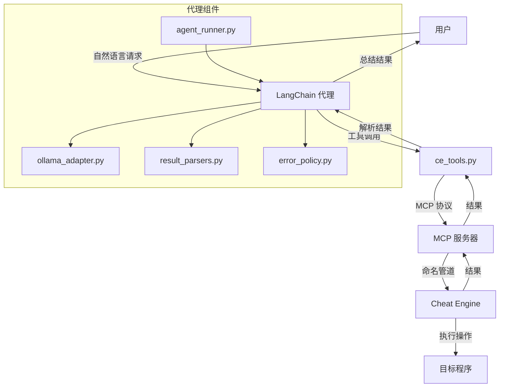

# MCP LangChain Agent (预案 C)

**将 LangChain 强大的代理能力与 Cheat Engine MCP Bridge 无缝集成。**

通过 LangChain 框架，将 AI 代理的推理能力与 Cheat Engine 的内存分析能力相结合，实现更智能、更自动化的内存分析和逆向工程工作流程。

[](#) [](https://python.org)

---

## 引入

在复杂的内存分析任务中，单纯的工具调用往往不足以解决问题。你需要一个能够理解上下文、规划步骤、执行复杂推理的智能代理。

**如果你可以让 AI 代理自主完成整个分析流程呢？**

> *"找到游戏的数据包解密函数，分析其算法并生成解密脚本。"*
> *"分析玩家数据结构，提取所有相关字段并生成结构定义。"*
> *"找到游戏的移动操作码，分析其工作原理并生成训练器代码。"*

**这正是此工具的作用。**

_- 停止手动调用工具，开始让 AI 代理自主完成复杂任务。_

---

## 你将获得：

| 之前（手动工具调用） | 之后（LangChain 代理） |
|----------------------|------------------------|
| 第1步：手动扫描值 | 第1步：AI 自主规划完整分析流程 |
| 第2步：手动设置断点 | 第2步：AI 自动执行所有必要工具调用 |
| 第3步：手动反汇编 | 第3步：AI 分析结果并生成最终解决方案 |
| 第4步：手动分析结构 | **完成。** |
| 第5步：手动编写脚本 | |

**你的 AI 代理现在可以：**
- 自主规划复杂任务的执行步骤
- 理解上下文，进行多步推理
- 自动调用所需的 Cheat Engine MCP 工具
- 分析结果并生成最终解决方案
- 在 LangChain 不可用时回退到内置执行循环
- 执行安全策略，审批破坏性操作
- 记录详细的执行日志，便于审计和调试

---

## 工作原理


### 核心执行流程
1. **用户请求**：用户以自然语言提出内存分析任务
2. **代理初始化**：agent_runner.py 初始化 LangChain 代理或回退到内置执行循环
3. **任务规划**：AI 代理分析请求，规划执行步骤
4. **工具调用**：代理调用 ce_tools.py 中封装的 Cheat Engine MCP 工具
5. **执行操作**：MCP 服务器将请求转发给 Cheat Engine 执行实际操作
6. **结果处理**：result_parsers.py 解析执行结果，确保结构化输出
7. **智能分析**：代理分析结果，进行多步推理
8. **解决方案生成**：代理生成最终解决方案并呈现给用户
9. **安全审计**：error_policy.py 确保安全执行，审批破坏性操作

---

## 安装

```bash
pip install -r requirements.txt
```


> [!NOTE]
> **依赖于 Cheat Engine MCP Bridge** - 确保已安装并运行主项目的 MCP 桥接

---

## 快速开始

### 1. 确保 Cheat Engine MCP Bridge 已运行
```
1. 在 CheatEngine 中启用 DBVM
2. 执行 ce_mcp_bridge.lua 脚本
3. 确认看到：`[MCP v11.4.0] Server started on \\.\\pipe\\CE_MCP_Bridge_v99`
```

### 2. 配置环境变量
```bash
# Ollama 服务器配置
set OLLAMA_URL=http://localhost:11434
set OLLAMA_MODEL=llama3.1:8b

# 代理配置
# 设置 AGENT_PROMPT 环境变量以自动执行特定任务
# set AGENT_PROMPT="找到游戏的金币地址并分析其修改函数"
```

### 3. 运行 LangChain 代理
```bash
# 交互式模式
python agent_runner.py

# 或通过模块路径运行
python -m cheatengine-mcp-bridge.LangChain_Agent.agent_runner
```

### 4. 开始提问
```
"找到游戏的金币地址并分析其修改函数"
"分析玩家数据结构并提取所有相关字段"
"找到数据包解密函数并生成解密脚本"
"ping并告诉我Cheat Engine的版本信息"
"读取地址0x401000处的内存"
```

---

## 核心组件

### 代理基础架构
| 组件 | 描述 | 关键功能 |
|------|-------------|----------|
| `ollama_adapter.py` | 与 Ollama HTTP API 的轻量适配器 | 提供模型访问、请求处理、响应解析、工具调用提取 |
| `ce_tools.py` | 将现有 Cheat Engine 桥接封装为可注册给 agent 的工具 | 工具封装、结果解析、错误处理、安全策略应用 |
| `result_parsers.py` | pydantic 解析器，保证工具输出结构化 | 结构化结果验证、错误处理、格式转换 |
| `error_policy.py` | 生产级的重试与破坏性操作审批钩子 | 重试策略、破坏性操作审批、安全检查 |
| `agent_runner.py` | 启动 agent 的入口，优先使用 LangChain；若不可用则回退到内置执行循环 | 代理初始化、LangChain 集成、回退机制、交互式模式 |

### 工具集
| 工具类别 | 描述 | 具体功能 |
|----------|-------------|----------|
| 内存操作 | 读取内存、指针链解析、结构分析 | read_memory, read_string, read_pointer, read_pointer_chain |
| 脚本控制 | Lua 执行、自动汇编、连接验证 | evaluate_lua, auto_assemble, ping |
| 安全操作 | 受保护的工具调用 | 破坏性操作审批、重试机制 |

### 错误处理与安全
| 功能 | 描述 | 实现 |
|------|-------------|----------|
| 重试策略 | 对关键操作实现重试机制 | retry_on_exception 装饰器，最多3次尝试 |
| 破坏性操作审批 | 对潜在危险操作进行审批控制 | require_destructive_approval 装饰器 |
| 异常处理 | 全面的异常捕获和处理 | try-except 块，确保系统稳定性 |
| 审计日志 | 记录所有工具调用和执行结果 | 详细的日志文件，包含时间戳和执行步骤 |

---

## 关键配置

### 安全配置
> [!CAUTION]
> **生产环境必须：**
> 
> 1. 确保 `AGENT_ALLOW_DESTRUCTIVE` 环境变量设置为 0，禁用破坏性操作
> 2. 启用审计日志，记录所有工具调用和 LLM prompts
> 3. 在 `error_policy.py` 中配置适当的审批逻辑

### 性能配置
> [!TIP]
> **优化建议：**
> 
> 1. 选择合适的 Ollama 模型，平衡性能和准确性
> 2. 调整 `max_tokens` 和 `temperature` 参数以优化推理速度
> 3. 对于复杂任务，考虑使用更强大的模型（如 70B 参数模型）

---

## 示例工作流

**分析玩家数据结构：**
```
你："分析游戏中的玩家数据结构"
AI："开始分析玩家数据结构..."
AI："1. 扫描玩家相关值..."
AI："2. 设置断点跟踪数据访问..."
AI："3. 反汇编相关函数..."
AI："4. 分析内存结构..."
AI："玩家数据结构分析完成："
AI："- 0x00: vtable (ptr)"
AI："- 0x08: health (float)"
AI："- 0x10: position (vector3)"
AI："- 0x20: inventory (ptr)"
```

**找到并分析解密函数：**
```
你："找到游戏的数据包解密函数并分析其算法"
AI："开始寻找数据包解密函数..."
AI："1. 扫描网络相关值..."
AI："2. 设置断点跟踪数据包处理..."
AI："3. 反汇编解密函数..."
AI："4. 分析算法逻辑..."
AI："解密函数分析完成："
AI："- 函数地址: 0x12345678"
AI："- 算法: AES-128-CBC"
AI："- 密钥位置: [[game.exe+0x1000]+0x20]"
AI："- 生成了解密脚本: decrypt_packet.py"
```

**交互式内存分析：**
```
你："ping并读取内存地址0x401000"
AI："正在执行ping操作..."
AI："✅ CE MCP Bridge v11.4.0 运行中"
AI："正在读取内存地址0x401000..."
AI："内存读取结果："
AI："- 地址: 0x401000"
AI："- 大小: 256字节"
AI："- 数据: 4D 5A 90 00 03 00 00 00 04 00 00 00 FF FF 00 00..."
AI："- 分析: 这是一个PE文件头部（MZ标记）"
```

---

## 项目结构

```
LangChain_Agent/
├── agent_runner.py          # 代理运行入口
├── ce_tools.py              # Cheat Engine工具封装
├── ollama_adapter.py        # Ollama API适配器
├── result_parsers.py        # 结果解析器
├── error_policy.py          # 错误处理与安全策略
├── README_AGENT.md          # LangChain代理文档
├── __init__.py              # 包初始化
├── issue.md                 # 问题记录
├── output.txt               # 输出示例
└── logs/                    # 日志目录
```

---

## 日志系统

### 日志功能
- **详细执行日志**：记录所有工具调用和执行结果
- **时间戳**：每条日志包含精确的时间戳
- **原始响应**：记录 Ollama API 的原始响应
- **执行步骤**：记录代理执行的每个步骤

### 日志位置
```
LangChain_Agent/
└── logs/
    └── agent_log_20240101_120000.log  # 按日期时间命名的日志文件
```

### 日志示例
```
[2024-01-01 12:00:00.123456] Raw Response:
{
  "text": "{\"tool_call\": {\"name\": \"ping\", \"args\": {}}}",
  "raw": {
    "model": "llama3.1:8b",
    "created_at": "2024-01-01T12:00:00.000Z",
    "response": "{\"tool_call\": {\"name\": \"ping\", \"args\": {}}}",
    "done": true
  }
}
================================================================================
```

---

## 测试

### 运行测试
```bash
# 测试 Ollama 连接
python -c "from ollama_adapter import OllamaClient; client = OllamaClient(); print('Ollama 连接测试通过')"

# 测试 Cheat Engine MCP 连接
python -c "from ce_tools import ping; print('Cheat Engine MCP 连接测试:', ping())"

# 运行代理测试
python agent_runner.py
```

### 预期输出
```
✅ Ollama 连接测试通过
✅ Cheat Engine MCP 连接测试通过
✅ LangChain 代理初始化成功
✅ 内置执行循环测试通过
```

---

## 技术实现亮点

### 1. 灵活的代理架构
- **双模式执行**：同时支持 LangChain 和内置执行循环
- **可扩展性**：模块化设计，便于添加新功能和集成其他模型
- **配置驱动**：通过环境变量和配置文件控制行为
- **回退机制**：在 LangChain 不可用时自动切换到内置执行循环

### 2. 安全机制
- **破坏性操作审批**：对潜在危险操作进行审批控制
- **审计日志**：详细的日志记录，便于审计和调试
- **异常处理**：全面的异常捕获和处理，确保系统稳定性
- **重试策略**：对网络和通信错误实现自动重试

### 3. 工具封装
- **统一接口**：将 Cheat Engine MCP 工具封装为标准格式
- **结果标准化**：使用 pydantic 确保工具输出结构化
- **错误处理**：统一的错误处理机制，提高可靠性
- **安全策略**：应用安全策略，保护系统免受危险操作

### 4. Ollama 集成
- **轻量级适配器**：与 Ollama HTTP API 进行高效交互
- **灵活配置**：支持通过环境变量配置模型参数
- **响应解析**：智能解析不同格式的 Ollama 响应
- **工具调用提取**：从 LLM 输出中提取工具调用指令

### 5. 交互式体验
- **用户友好界面**：清晰的命令行界面，便于用户交互
- **实时反馈**：执行过程中的实时状态更新
- **错误提示**：友好的错误提示和处理建议
- **示例提示**：提供常见任务的示例提示

---

## 应用场景

- **复杂内存分析**：需要多步操作的内存分析任务
- **自动化逆向工程**：自动完成逆向工程的各个步骤
- **智能训练器开发**：分析游戏机制并生成训练器代码
- **安全审计**：自动检测程序中的安全漏洞
- **教育研究**：作为 AI 辅助内存分析的教学工具
- **快速原型开发**：快速验证内存分析思路和方法

---

## 技术栈

| 类别 | 技术/工具 | 用途 | 来源 |
|------|-----------|------|------|
| 编程语言 | Python 3.10+ | 代理系统实现 | 所有组件 |
| 框架 | LangChain（可选） | 提供代理能力 | agent_runner.py |
| API | Ollama HTTP API | 提供 LLM 能力 | ollama_adapter.py |
| 数据验证 | Pydantic | 结果解析和验证 | result_parsers.py |
| 通信协议 | MCP（JSON-RPC over stdio） | 与 MCP 服务器通信 | ce_tools.py |
| 依赖管理 | pip | 安装依赖 | requirements.txt |
| 日志系统 | 自定义日志 | 审计和调试 | agent_runner.py |

---

## 总结

MCP LangChain Agent 为 Cheat Engine MCP Bridge 增添了智能代理能力，使复杂的内存分析任务变得更加自动化和智能化。通过 LangChain 框架，AI 代理可以理解上下文、规划步骤、执行复杂推理，自主完成整个分析流程。

**核心优势：**
- **智能自动化**：AI 代理可以自主规划和执行复杂任务
- **灵活可靠**：支持 LangChain 和内置执行循环双重模式
- **安全可控**：实现了完善的安全策略和错误处理机制
- **用户友好**：提供交互式界面和实时反馈
- **高度可扩展**：模块化设计，便于添加新功能和集成其他模型

⚠️ 教育免责声明

此代码仅用于教育和研究目的。它的创建是为了展示 LangChain 代理与内存分析工具的集成能力。我不赞成将这些工具用于恶意黑客攻击、多人游戏作弊或违反服务条款。这是软件工程自动化的演示。

---

## 技术分析报告

### 1. 项目概述

MCP LangChain Agent 是一个智能代理系统，旨在将 LangChain 的推理能力与 Cheat Engine MCP Bridge 相结合，实现复杂内存分析任务的自动化。通过自然语言交互，用户可以让 AI 代理自主完成从问题分析到解决方案生成的整个流程。

**核心价值**：将通常需要手动执行的多步内存分析任务转变为 AI 代理的自主执行流程，显著提高分析效率和准确性。

### 2. 架构设计

项目采用模块化架构设计，通过标准化的接口实现组件间的高效交互：

#### 2.1 架构层次

| 层次 | 组件 | 职责 | 通信方式 |
|------|------|------|----------|
| 顶层 | 用户 | 提供自然语言请求 | 命令行交互 |
| 代理层 | LangChain 代理或内置执行循环 | 理解请求，规划步骤，执行推理 | 工具调用 |
| 工具层 | ce_tools.py | 封装 Cheat Engine MCP 工具 | MCP 协议 |
| 服务层 | MCP 服务器 | 处理工具调用请求 | 命名管道 |
| 底层 | Cheat Engine | 执行实际的内存操作 | Lua API |

#### 2.2 数据流

1. 用户通过自然语言向代理提出内存分析任务
2. agent_runner.py 初始化 LangChain 代理或回退到内置执行循环
3. AI 代理分析请求，规划执行步骤
4. 代理调用 ce_tools.py 中封装的 Cheat Engine MCP 工具
5. ce_tools.py 通过 MCP 协议向 MCP 服务器发送请求
6. MCP 服务器通过命名管道将请求转发给 Cheat Engine
7. Cheat Engine 执行实际操作并返回结果
8. 结果通过反向路径返回给代理
9. 代理分析结果并生成最终解决方案
10. 代理将解决方案呈现给用户

### 3. 核心功能与实现

#### 3.1 代理系统

- **LangChain 集成**：优先使用 LangChain 框架提供的代理能力
- **回退机制**：在 LangChain 不可用时回退到内置执行循环
- **上下文管理**：维护任务执行的上下文信息
- **推理能力**：进行多步推理，规划复杂任务的执行步骤
- **交互式模式**：提供用户友好的命令行界面

#### 3.2 工具封装

- **Cheat Engine MCP 工具封装**：将现有 MCP 工具封装为 LangChain 可用的工具
- **结果解析**：使用 pydantic 解析器确保工具输出结构化
- **错误处理**：实现生产级的错误处理和重试机制
- **安全策略**：提供破坏性操作的审批机制

#### 3.3 Ollama 集成

- **轻量级适配器**：与 Ollama HTTP API 进行交互
- **模型配置**：支持通过环境变量配置模型参数
- **请求处理**：处理与 Ollama 服务器的通信
- **响应解析**：智能解析不同格式的 Ollama 响应
- **工具调用提取**：从 LLM 输出中提取工具调用指令

#### 3.4 错误处理与安全

- **重试策略**：对关键操作实现重试机制，最多3次尝试
- **破坏性操作审批**：对潜在危险操作进行审批控制
- **审计日志**：记录所有工具调用和执行结果
- **异常处理**：全面的异常捕获和处理，确保系统稳定性

### 4. 技术实现亮点

#### 4.1 灵活的代理架构

- **双模式执行**：同时支持 LangChain 和内置执行循环，提高系统可靠性
- **可扩展性**：模块化设计，便于添加新功能和集成其他模型
- **配置驱动**：通过环境变量和配置文件控制行为，提高灵活性
- **回退机制**：在 LangChain 不可用时自动切换到内置执行循环，确保系统可用性

#### 4.2 安全机制

- **破坏性操作审批**：对潜在危险操作进行审批控制，保护系统安全
- **审计日志**：详细的日志记录，便于审计和调试
- **异常处理**：全面的异常捕获和处理，确保系统稳定性
- **重试策略**：对网络和通信错误实现自动重试，提高系统可靠性

#### 4.3 工具封装

- **统一接口**：将 Cheat Engine MCP 工具封装为标准格式，简化集成
- **结果标准化**：使用 pydantic 确保工具输出结构化，提高数据一致性
- **错误处理**：统一的错误处理机制，提高系统可靠性
- **安全策略**：应用安全策略，保护系统免受危险操作

#### 4.4 Ollama 集成

- **轻量级适配器**：与 Ollama HTTP API 进行高效交互，减少开销
- **灵活配置**：支持通过环境变量配置模型参数，提高灵活性
- **响应解析**：智能解析不同格式的 Ollama 响应，提高兼容性
- **工具调用提取**：从 LLM 输出中提取工具调用指令，实现自动工具调用

#### 4.5 交互式体验

- **用户友好界面**：清晰的命令行界面，便于用户交互
- **实时反馈**：执行过程中的实时状态更新，提高用户体验
- **错误提示**：友好的错误提示和处理建议，帮助用户解决问题
- **示例提示**：提供常见任务的示例提示，引导用户使用

### 5. 部署与使用

#### 5.1 环境要求

- **操作系统**：Windows（依赖 Cheat Engine MCP Bridge）
- **Python**：3.10+
- **依赖**：
  - langchain（可选，优先使用）
  - requests（Ollama 集成）
  - pydantic（结果解析）
  - mcp（Cheat Engine MCP Bridge 依赖）

#### 5.2 安装步骤

1. **安装依赖**：
   ```bash
   pip install -r requirements.txt
   ```

2. **配置环境变量**：
   ```bash
   set OLLAMA_URL=http://localhost:11434
   set OLLAMA_MODEL=llama3.1:8b
   ```

3. **启动 Cheat Engine MCP Bridge**：
   - 在 Cheat Engine 中启用 DBVM
   - 执行 ce_mcp_bridge.lua 脚本

4. **运行代理**：
   ```bash
   python -m cheatengine-mcp-bridge.LangChain_Agent.agent_runner
   ```

### 6. 应用场景

- **复杂内存分析**：需要多步操作的内存分析任务
- **自动化逆向工程**：自动完成逆向工程的各个步骤
- **智能训练器开发**：分析游戏机制并生成训练器代码
- **安全审计**：自动检测程序中的安全漏洞
- **教育研究**：作为 AI 辅助内存分析的教学工具
- **快速原型开发**：快速验证内存分析思路和方法

### 7. 技术栈

| 类别 | 技术/工具 | 用途 | 来源 |
|------|-----------|------|------|
| 编程语言 | Python 3.10+ | 代理系统实现 | 所有组件 |
| 框架 | LangChain（可选） | 提供代理能力 | agent_runner.py |
| API | Ollama HTTP API | 提供 LLM 能力 | ollama_adapter.py |
| 数据验证 | Pydantic | 结果解析和验证 | result_parsers.py |
| 通信协议 | MCP（JSON-RPC over stdio） | 与 MCP 服务器通信 | ce_tools.py |
| 依赖管理 | pip | 安装依赖 | requirements.txt |
| 日志系统 | 自定义日志 | 审计和调试 | agent_runner.py |

### 8. 结论

MCP LangChain Agent 是一个技术先进的智能代理系统，通过将 LangChain 的推理能力与 Cheat Engine MCP Bridge 相结合，创造了新的内存分析工作流程。它不仅显著提高了内存分析效率，还降低了技术门槛，使更多开发者和研究人员能够执行复杂的内存分析工作。

项目的架构设计清晰，技术实现精湛，功能丰富，使其成为逆向工程和内存分析领域的重要工具。它展示了如何将现代 AI 代理技术与传统系统工具相结合，创造具有革命性价值的解决方案。

**未来发展潜力**：
- 集成更多 LLM 提供商（如 OpenAI、Anthropic 等）
- 添加更多高级分析功能和工具
- 开发图形界面，进一步降低使用门槛
- 集成更多逆向工程工具，形成完整的分析生态系统
- 增强代理的自主学习能力，提高分析效率和准确性

### 9. 声明

此工具仅用于教育和研究目的，不应用于恶意黑客攻击、多人游戏作弊或违反服务条款。用户在使用时应遵守相关法律法规和道德规范。