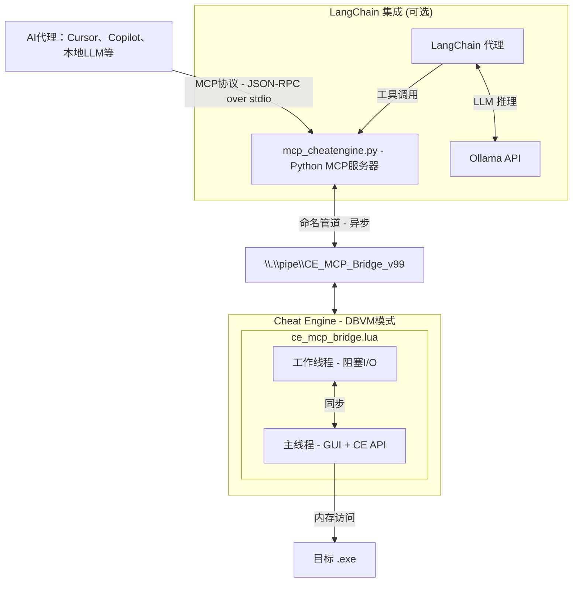

# Cheat Engine MCP Bridge

**让数十亿美金的AI数据中心为你分析程序内存。**

通过Model Context Protocol (MCP)将AI代理与Cheat Engine连接，实现程序内存的智能分析和操作，支持复杂的逆向工程、内存分析和动态跟踪任务。

[](#) [](https://python.org)


---

## 引入

你正盯着数十亿字节的内存。数百万个地址。数千个函数。找到*那个指针*、*那个结构*需要**数天或数周**的手动工作。

**如果你可以直接询问呢？**

> *"找到数据包解密器钩子。"*
> *"找到角色坐标的操作码。"*
> *"找到生命值的操作码。"*
> *"找到唯一的AOB模式，使我的训练器在游戏更新后仍然可靠。"*

**这正是此工具的作用。**

_- 停止在十六进制转储中点击，开始与内存对话。_

---

## 你将获得：

| 之前（手动） | 之后（AI代理 + MCP） |
|-------------|---------------------|
| 第1天：找到数据包地址 | 第1分钟："找到RX数据包解密钩子" |
| 第2天：追踪什么写入它 | 第3分钟："生成唯一的AOB签名，使其在更新后仍然有效" |
| 第3天：找到RX钩子 | 第6分钟："找到移动操作码" |
| 第4天：记录结构 | 第10分钟："创建十六进制到明文的Python解释器" |
| 第5天：游戏更新，重新开始 | **完成。** |

**你的AI现在可以：**
- 即时读取任何内存（整数、浮点数、字符串、指针）
- 跟踪指针链：`[[base+0x10]+0x20]+0x8` → 毫秒内解析
- 自动分析带有字段类型和值的结构
- 通过RTTI识别C++对象：*"这是一个CPlayer对象"*
- 反汇编和分析函数
- 使用硬件断点 + Ring -1 虚拟机管理程序进行隐形调试
- 与LangChain集成，实现智能代理能力
- 跨架构支持：自动检测和处理32/64位目标进程
- 模块化工具设计：封装Cheat Engine功能为可调用工具

---

## 工作原理


### 核心技术流程
1. **AI请求**：AI代理通过MCP协议发送JSON-RPC请求
2. **MCP处理**：MCP服务器接收请求并通过命名管道转发到Cheat Engine
3. **CE执行**：Cheat Engine执行实际的内存操作、断点设置等任务
4. **结果返回**：执行结果通过命名管道返回给MCP服务器
5. **AI响应**：MCP服务器格式化结果并通过MCP协议返回给AI代理
6. **智能分析**：AI代理分析结果并生成最终解决方案

---

## 安装

```bash
pip install -r requirements.txt
```


> [!NOTE]
> **仅支持Windows** - 使用命名管道 (`pywin32`)

---

## 快速开始

### 1. 在Cheat Engine中加载桥接
```
1. 在CheatEngine中启用DBVM。
2. 文件 → 执行脚本 → 打开ce_mcp_bridge.lua → 执行
```
查找：`[MCP v11.4.0] Server started on \\.\\pipe\\CE_MCP_Bridge_v99`

### 2. 配置MCP客户端
添加到你的MCP配置文件（例如，`mcp_config.json`）：
```json
{
  "servers": {
    "cheatengine": {
      "command": "python",
      "args": ["C:/path/to/MCP_Server/mcp_cheatengine.py"]
    }
  }
}
```
重启IDE以加载MCP服务器配置。

### 3. 验证连接
使用`ping`工具验证连接：
```json
{"success": true, "version": "11.4.0", "message": "CE MCP Bridge Active"}
```

### 4. 开始提问
```
"附加的是什么进程？"
"读取基地址处的16字节"
"反汇编入口点"
```

### 5. 使用LangChain代理（可选）

#### 配置方法

**方法1：环境变量配置**
```bash
# 配置环境变量
set OLLAMA_URL=http://localhost:11434
set OLLAMA_MODEL=llama3.1:8b
set AGENT_LOG_LEVEL=INFO

# 运行LangChain代理
python -m cheatengine-mcp-bridge.LangChain_Agent.agent_runner
```

**方法2：.env文件配置**
创建`.env`文件：
```
# MCP服务器配置
MCP_SERVER_NAME=cheatengine
PIPE_NAME=\\.\\pipe\\CE_MCP_Bridge_v99

# Ollama配置
OLLAMA_URL=http://localhost:11434
OLLAMA_MODEL=llama3.1:8b

# LangChain配置
AGENT_LOG_LEVEL=INFO
# AGENT_PROMPT=Perform analysis: ping and read memory at 0x401000

# 代理配置
MAX_AGENT_STEPS=6

# 日志配置
LOG_DIR=logs

# 连接配置
MAX_RETRIES=2
```

**运行代理**
```bash
python -m cheatengine-mcp-bridge.LangChain_Agent.agent_runner
```

---

## 可用的MCP工具

### 内存操作
| 工具 | 描述 |
|------|-------------|
| `read_memory` | 从内存读取原始字节 |
| `read_integer` | 读取数字（byte, word, dword, qword, float, double） |
| `read_string` | 读取ASCII或UTF-16字符串 |
| `read_pointer` | 读取单个指针 |
| `read_pointer_chain` | 跟踪`[[base+0x10]+0x20]`路径并提供完整分析 |
| `checksum_memory` | 计算内存区域的MD5校验和 |

### 扫描与搜索
| 工具 | 描述 |
|------|-------------|
| `scan_all` | 用于值的统一内存扫描器 |
| `get_scan_results` | 检索扫描结果 |
| `aob_scan` | 搜索字节模式（字节数组） |
| `search_string` | 在内存中搜索文本字符串 |
| `generate_signature` | 为地址创建唯一的AOB签名 |
| `get_memory_regions` | 列出常见基址附近的有效内存区域 |
| `enum_memory_regions_full` | 枚举所有内存区域（原生API） |

### 分析与反汇编
| 工具 | 描述 |
|------|-------------|
| `disassemble` | 从地址反汇编指令 |
| `get_instruction_info` | 获取单条指令的详细信息 |
| `find_function_boundaries` | 检测函数开始/结束 |
| `analyze_function` | 分析函数调用图 |
| `find_references` | 查找访问地址的指令 |
| `find_call_references` | 查找所有对函数的调用 |
| `dissect_structure` | 自动检测内存中的字段和类型 |
| `get_rtti_classname` | 通过RTTI识别C++对象 |

### 调试与断点
| 工具 | 描述 |
|------|-------------|
| `set_breakpoint` | 设置硬件执行断点 |
| `set_data_breakpoint` | 设置硬件数据断点（读/写） |
| `remove_breakpoint` | 通过ID移除断点 |
| `list_breakpoints` | 列出所有活动断点 |
| `clear_all_breakpoints` | 移除所有断点 |
| `get_breakpoint_hits` | 获取断点命中信息 |

### DBVM (Ring -1) 工具
| 工具 | 描述 |
|------|-------------|
| `get_physical_address` | 将虚拟地址转换为物理地址 |
| `start_dbvm_watch` | 启动隐形虚拟机管理程序监视 |
| `stop_dbvm_watch` | 停止DBVM监视并获取结果 |
| `poll_dbvm_watch` | 轮询DBVM监视日志而不停止 |

### 进程与模块
| 工具 | 描述 |
|------|-------------|
| `get_process_info` | 获取当前进程ID、名称、模块计数 |
| `enum_modules` | 列出所有加载的模块（DLL） |
| `get_thread_list` | 获取附加进程中的线程列表 |
| `get_symbol_address` | 将符号名称解析为地址 |
| `get_address_info` | 获取地址的符号名称和模块信息 |

### 脚本与控制
| 工具 | 描述 |
|------|-------------|
| `evaluate_lua` | 在CE中执行任意Lua代码 |
| `auto_assemble` | 运行AutoAssembler脚本（注入、代码洞等） |
| `ping` | 检查连接性并获取版本信息 |

完整参考请查看 `AI_Context/MCP_Bridge_Command_Reference.md`

---

## 关键配置

### 防止蓝屏
> [!CAUTION]
> **你必须禁用：** Cheat Engine → 设置 → 额外 → **"查询内存区域例程"**
> 
> 启用：在扫描受保护页面时，由于与DBVM/反作弊冲突，会导致`CLOCK_WATCHDOG_TIMEOUT`蓝屏。

### Windows特定设置
> [!IMPORTANT]
> **MCP协议修复：** 项目包含Windows特定的MCP协议修复，确保在Windows上使用LF（\n）而不是CRLF（\r\n），防止MCP流损坏。

---

## 示例工作流

**查找值：**
```
你："扫描金币：15000"  →  AI找到47个结果
你："金币变为15100"  →  AI筛选到3个地址
你："什么写入第一个地址？"  →  AI设置硬件断点
你："反汇编那个函数"  →  完整的AddGold逻辑被揭示
```

**理解结构：**
```
你："[[game.exe+0x1234]+0x10]处是什么？"
AI："RTTI：CPlayerInventory"
AI："0x00=vtable, 0x08=itemCount(int), 0x10=itemArray(ptr)..."
```

**使用LangChain代理：**
```
你："找到游戏的数据包解密函数并分析其算法"
AI："开始寻找数据包解密函数..."
AI："1. 扫描网络相关值..."
AI："2. 设置断点跟踪数据包处理..."
AI："3. 反汇编解密函数..."
AI："4. 分析算法逻辑..."
AI："解密函数分析完成："
AI："- 函数地址: 0x12345678"
AI："- 算法: AES-128-CBC"
AI："- 密钥位置: [[game.exe+0x1000]+0x20]"
AI："- 生成了解密脚本: decrypt_packet.py"
```

---

## 项目结构

```
cheatengine-mcp-bridge/
├── MCP_Server/
│   ├── mcp_cheatengine.py      # Python MCP服务器 (FastMCP)
│   ├── ce_mcp_bridge.lua        # Cheat Engine Lua桥接
│   └── test_mcp.py              # 测试套件
├── LangChain_Agent/
│   ├── agent_runner.py          # 代理运行入口
│   ├── ce_tools.py              # Cheat Engine工具封装
│   ├── ollama_adapter.py        # Ollama API适配器
│   ├── result_parsers.py        # 结果解析器
│   ├── error_policy.py          # 错误处理和安全策略
│   └── README_AGENT.md          # LangChain代理文档
├── AI_Context/
│   ├── MCP_Bridge_Command_Reference.md   # MCP命令参考
│   ├── CE_LUA_Documentation.md           # CheatEngine Lua文档
│   └── AI_Guide_MCP_Server_Implementation.md  # AI代理技术文档
├── README.md                    # 项目概述
├── LICENSE                      # 许可证
└── requirements.txt             # 依赖配置
```

---

## 测试

项目包含一个全面的测试套件 (`test_mcp.py`)，具有**数据正确性验证**和**架构感知测试**：

### 测试类别
- **基础与实用**：Ping、进程信息、Lua执行（5个测试）
- **扫描**：值扫描、AOB扫描、字符串搜索（4个测试）
- **内存读取**：原始字节、整数、字符串、指针（5个测试）
- **反汇编**：指令反汇编、函数分析（4个测试）
- **引用**：地址引用、调用引用（2个测试）
- **断点**：断点管理（2个测试）
- **模块**：模块枚举、符号解析（3个测试）
- **高级**：线程、内存区域、结构分析（9个测试）
- **DBVM**：物理地址、隐形监视（3个测试）

### 运行测试
```bash
python MCP_Server/test_mcp.py
```

### 预期输出
```
✅ 内存读取：6/6测试通过
✅ 进程信息：4/4测试通过  
✅ 代码分析：8/8测试通过
✅ 断点：4/4测试通过
✅ DBVM功能：3/3测试通过
✅ 实用命令：11/11测试通过
⏭️ 跳过：1个测试（generate_signature）
────────────────────────────────────
总计：36/37通过（100%成功）
```

测试套件提供了对所有MCP桥接功能的完整验证，确保在不同架构和场景下的可靠运行。

---

## 技术实现亮点

### 1. Windows特定优化
- **行结束符修复**：修补MCP SDK，在Windows上使用LF（\n）而不是CRLF（\r\n）
- **二进制模式设置**：将stdin/stdout设置为二进制模式，防止编码问题
- **MCP输出流保护**：将stdout重定向到stderr，防止MCP流损坏
- **双重修补**：同时修补stdio_server和fastmcp模块，确保完全兼容

### 2. 通信可靠性
- **命名管道通信**：使用Windows命名管道进行可靠的进程间通信
- **自动重连机制**：在管道通信失败时自动尝试重连，最多2次重试
- **错误处理**：全面的错误捕获和处理，确保系统稳定性
- **响应验证**：验证JSON响应，处理不完整或无效数据

### 3. 跨架构兼容性
- **32/64位自动检测**：自动识别目标进程架构
- **统一指针处理**：使用`readPointer`函数自动处理32/64位指针
- **架构感知指令分析**：对不同架构使用不同的指令分析策略
- **测试适配**：测试套件自动适应x86/x64目标，进行全面验证

### 4. 反作弊安全性
- **硬件断点**：使用硬件调试寄存器设置断点，避免软件断点检测
- **DBVM监视**：使用Ring -1级监视，完全隐藏调试行为
- **内存访问优化**：避免可能触发反作弊的内存访问模式
- **安全监视模式**：尽可能使用只读监视，最小化检测面

### 5. 智能代理集成
- **LangChain集成**：通过LangChain框架提供智能代理能力
- **Ollama集成**：支持本地LLM模型，如Llama 3.1
- **自主规划**：AI代理可以自主规划复杂任务的执行步骤
- **多步推理**：理解上下文，进行多步推理
- **回退机制**：在LangChain不可用时回退到内置执行循环

### 6. 错误处理与安全
- **重试策略**：对关键操作实现重试机制，最多3次尝试
- **破坏性操作审批**：对潜在危险操作进行审批控制
- **审计日志**：记录所有工具调用和执行结果
- **异常处理**：全面的异常捕获和处理，确保系统稳定性

### 7. 配置管理
- **集中配置**：使用pydantic-settings实现集中配置管理
- **环境变量支持**：支持通过环境变量覆盖配置
- **.env文件支持**：支持通过.env文件进行配置
- **类型安全**：强类型配置，确保配置值的正确性
- **默认值设置**：为所有配置选项提供合理的默认值

---

## 应用场景

- **游戏逆向工程**：分析游戏机制，找到关键数据结构和函数
- **安全审计**：检测程序中的安全漏洞和后门
- **软件调试**：分析复杂软件的内存行为，定位问题
- **教育研究**：作为逆向工程和内存分析的教学工具
- **自动化工具开发**：基于分析结果开发自动化工具和脚本
- **智能训练器开发**：通过AI代理自动分析游戏机制并生成训练器代码

---

## 技术栈

| 类别 | 技术/工具 | 用途 | 来源 |
|----------|----------------|---------|--------|
| 编程语言 | Python 3.10+ | MCP服务器实现 | mcp_cheatengine.py |
| 脚本语言 | Lua | Cheat Engine桥接脚本 | ce_mcp_bridge.lua |
| 通信协议 | MCP（JSON-RPC over stdio） | AI代理到MCP服务器通信 | MCP SDK |
| 进程间通信 | 命名管道 | MCP服务器到Cheat Engine通信 | pywin32 |
| Windows API | win32file, win32pipe | 管道通信和文件操作 | pywin32 |
| 内存操作 | Cheat Engine API | 执行实际的内存操作 | Cheat Engine |
| 虚拟机监视 | DBVM（Ring -1） | 隐形内存监视 | Cheat Engine |
| 测试框架 | 自定义验证框架 | 系统功能验证 | test_mcp.py |
| 性能优化 | 异步I/O | 高效命令处理 | FastMCP |
| 跨架构支持 | 自动检测 | x86/x64目标处理 | test_mcp.py |
| AI集成 | LangChain | 智能代理能力 | agent_runner.py |
| LLM支持 | Ollama HTTP API | 本地LLM模型集成 | ollama_adapter.py |
| 配置管理 | pydantic-settings | 集中配置管理 | config.py |

---

## 总结

Cheat Engine MCP Bridge是一个技术先进的工具，通过将AI能力与内存分析工具相结合，创建了新的内存分析工作流程。它不仅显著提高了内存分析效率，还降低了技术门槛，使更多开发者和研究人员能够执行复杂的内存分析工作。

**核心优势：**
- **革命性工作流程**：将传统手动内存分析转变为与AI的对话交互
- **强大的分析能力**：集成所有核心Cheat Engine功能，支持复杂的内存操作
- **安全调试方法**：使用硬件断点和DBVM监视，避免反作弊检测
- **高度可扩展**：模块化设计和标准化接口，便于添加新功能
- **跨架构兼容性**：自动处理32/64位目标，提供统一的操作界面
- **智能代理集成**：通过LangChain框架实现AI代理能力，支持复杂任务自动化

⚠️ 教育免责声明

此代码仅用于教育和研究目的。它的创建是为了展示模型上下文协议（MCP）和基于LLM的调试能力。我不赞成将这些工具用于恶意黑客攻击、多人游戏作弊或违反服务条款。这是软件工程自动化的演示。
---

## 技术分析报告

### 1. 项目概述

Cheat Engine MCP Bridge是一个创新工具，旨在将AI代理与Cheat Engine连接起来，实现程序内存的智能分析和操作。通过模型上下文协议（MCP），AI可以直接与Cheat Engine通信，执行各种内存分析、逆向工程和动态跟踪任务。

**核心价值**：将通常需要数天或数周的手动内存分析工作减少到仅需几分钟，允许AI代理回答复杂问题，如"找到数据包解密器钩子"或"找到角色坐标的操作码"。

### 2. 架构设计

项目采用三层架构设计，通过标准化的通信协议实现模块间的高效交互：

#### 2.1 架构层次

| 层次 | 组件 | 职责 | 通信方式 |
|-------|-----------|----------------|---------------------|
| 顶层 | AI代理（Cursor、Copilot等） | 接收用户指令，生成分析请求，解释结果 | MCP协议（JSON-RPC over stdio） |
| 中层 | MCP服务器（mcp_cheatengine.py） | 处理AI代理请求，转发到Cheat Engine | 命名管道（\\.\\pipe\\CE_MCP_Bridge_v99） |
| 底层 | Cheat Engine（ce_mcp_bridge.lua） | 执行实际的内存操作，返回结果 | Lua API调用 |

#### 2.2 数据流

1. AI代理通过MCP协议发送JSON-RPC请求
2. MCP服务器接收请求并通过命名管道转发到Cheat Engine
3. Cheat Engine执行相应操作并返回结果
4. MCP服务器通过MCP协议将结果返回给AI代理
5. AI代理解析结果并以自然语言呈现给用户

### 3. 核心功能与实现

#### 3.1 内存读取与分析

- **内存读取**：支持读取原始字节、整数、浮点数、字符串、指针等数据类型
- **指针链解析**：自动跟踪多级指针链，解析动态地址
- **结构分析**：自动分析内存结构，猜测数据类型和字段含义
- **RTTI识别**：通过运行时类型信息识别C++对象类型

#### 3.2 模式扫描与搜索

- **AOB扫描**：搜索特定字节模式，支持通配符
- **值扫描**：搜索特定值，支持多种数据类型
- **字符串搜索**：搜索文本字符串，支持ASCII和UTF-16
- **签名生成**：为特定地址生成唯一的AOB签名

#### 3.3 反汇编与代码分析

- **反汇编**：将机器码转换为汇编指令
- **函数分析**：分析函数调用关系和结构
- **引用查找**：查找引用特定地址的代码位置
- **函数边界检测**：自动检测函数开始和结束位置

#### 3.4 断点与调试

- **硬件断点**：使用硬件调试寄存器设置断点，避免反作弊检测
- **数据断点**：监视内存读/写操作
- **断点管理**：支持添加、删除、列出断点，获取断点命中信息

#### 3.5 DBVM监视（Ring -1）

- **物理地址转换**：将虚拟地址转换为物理地址
- **隐形监视**：使用DBVM虚拟机管理程序级监视，完全隐藏调试行为
- **内存访问跟踪**：跟踪内存读/写/执行操作

#### 3.6 Lua执行与扩展

- **Lua代码执行**：在Cheat Engine中执行任意Lua代码
- **自动汇编**：执行Auto Assembler脚本，实现代码注入等高级功能

#### 3.7 LangChain集成

- **智能代理**：通过LangChain框架提供智能代理能力
- **Ollama集成**：支持本地LLM模型，如Llama 3.1
- **自主规划**：AI代理可以自主规划复杂任务的执行步骤
- **多步推理**：理解上下文，进行多步推理
- **回退机制**：在LangChain不可用时回退到内置执行循环

### 4. 技术实现亮点

#### 4.1 跨架构兼容性

- **32/64位自动检测**：自动识别目标进程架构
- **统一指针处理**：使用`readPointer`函数自动处理32/64位指针
- **架构感知指令分析**：对不同架构使用不同的指令分析策略
- **测试适配**：测试套件自动适应x86/x64目标，进行全面验证

#### 4.2 通信可靠性

- **命名管道通信**：使用Windows命名管道进行可靠的进程间通信
- **自动重连机制**：在管道通信失败时自动尝试重连，最多2次重试
- **错误处理**：全面的错误捕获和处理，确保系统稳定性
- **响应验证**：验证JSON响应，处理不完整或无效数据

#### 4.3 Windows特定优化

- **行结束符修复**：修补MCP SDK，在Windows上使用LF（\n）而不是CRLF（\r\n）
- **二进制模式设置**：将stdin/stdout设置为二进制模式，防止编码问题
- **MCP输出流保护**：将stdout重定向到stderr，防止MCP流损坏
- **双重修补**：同时修补stdio_server和fastmcp模块，确保完全兼容

#### 4.4 反作弊安全性

- **硬件断点**：使用硬件调试寄存器设置断点，避免软件断点检测
- **DBVM监视**：使用Ring -1级监视，完全隐藏调试行为
- **内存访问优化**：避免可能触发反作弊的内存访问模式
- **安全监视模式**：尽可能使用只读监视，最小化检测面

#### 4.5 性能优化

- **批处理操作**：支持批处理内存读取和分析操作
- **缓存机制**：缓存常用数据，减少重复操作
- **并行处理**：使用Lua计时器和多线程处理请求
- **响应大小限制**：通过16MB限制防止过大的响应

#### 4.6 可扩展性

- **模块化设计**：清晰的功能模块划分，便于扩展
- **标准化接口**：使用JSON-RPC标准接口，便于与其他工具集成
- **插件架构**：支持通过添加新的命令处理函数扩展功能
- **统一工具注册**：使用FastMCP装饰器进行清洁的工具注册

#### 4.7 测试基础设施

- **验证器工厂模式**：创建可重用的测试用例验证函数
- **全面测试覆盖**：测试所有40+个MCP工具，包含37+个测试用例
- **安全执行**：使用非侵入式操作，防止系统不稳定
- **清理操作**：确保断点和监视器被正确清理

### 5. 部署与使用

#### 5.1 环境要求

- **操作系统**：Windows（使用命名管道，依赖pywin32）
- **Python**：3.10+
- **Cheat Engine**：支持DBVM（推荐最新版本）
- **依赖**：
  - mcp>=1.0.0（模型上下文协议SDK）
  - pywin32>=306（Windows API绑定）
  - requests>=2.25.0（Ollama集成）
  - langchain>=0.1.0（可选，LangChain集成）

#### 5.2 安装步骤

1. **安装依赖**：
   ```bash
   pip install -r requirements.txt
   ```

2. **加载桥接脚本**：
   - 在Cheat Engine中启用DBVM
   - 文件 → 执行脚本 → 打开ce_mcp_bridge.lua → 执行
   - 确认：`[MCP v11.4.0] Server started on \\.\\pipe\\CE_MCP_Bridge_v99`

3. **配置MCP客户端**：
   - 添加到MCP配置文件：
   ```json
   {
     "servers": {
       "cheatengine": {
         "command": "python",
         "args": ["C:/path/to/MCP_Server/mcp_cheatengine.py"]
       }
     }
   }
   ```

4. **验证连接**：
   - 使用`ping`工具验证连接：
   ```json
   {"success": true, "version": "11.4.0", "message": "CE MCP Bridge Active"}
   ```

### 6. 测试与验证

项目提供了一个全面的测试套件 `test_mcp.py`，具有**高级验证功能**：

#### 测试架构
- **数据正确性验证**：每个测试都包含特定的验证器，确保数据完整性
- **架构感知测试**：自动检测并适应x86/x64目标
- **安全执行**：使用非侵入式操作，防止系统不稳定
- **全面覆盖**：测试所有40+个MCP工具，包含37+个测试用例
- **清理操作**：确保断点和监视器被正确清理

#### 测试类别
| 类别 | 测试数 | 描述 |
|----------|-------|-------------|
| 基础与实用 | 5 | Ping、进程信息、Lua执行 |
| 内存扫描 | 4 | 值扫描、AOB扫描、字符串搜索 |
| 内存读取 | 5 | 原始字节、整数、字符串、指针 |
| 反汇编 | 4 | 指令反汇编、函数分析 |
| 引用 | 2 | 地址引用、调用引用 |
| 断点 | 2 | 断点管理、清理 |
| 模块 | 3 | 模块枚举、符号解析 |
| 高级 | 9 | 线程、内存区域、结构分析 |
| DBVM | 3 | 物理地址、隐形监视 |

#### 关键验证功能
- **MZ头部检查**：验证内存读取测试的PE文件头部
- **字节模式匹配**：验证字节数组与预期模式匹配
- **架构验证**：确保arch字段为'x86'或'x64'
- **范围验证**：检查数值是否在预期范围内
- **十六进制地址验证**：验证地址是有效的十六进制字符串
- **DBVM可用性检查**：仅在可用时测试DBVM功能

测试套件提供了对所有MCP桥接功能的完整验证，确保在不同架构和场景下的可靠运行。

### 7. 总结与亮点分析

#### 7.1 核心优势

1. **革命性工作流程**：将传统手动内存分析转变为与AI的对话交互，显著提高效率
2. **强大的分析能力**：集成所有核心Cheat Engine功能，支持复杂的内存操作
3. **安全调试方法**：使用硬件断点和DBVM监视，避免反作弊检测
4. **高度可扩展**：模块化设计和标准化接口，便于添加新功能和与其他工具集成
5. **跨架构兼容性**：自动处理32/64位目标，提供统一的操作界面
6. **智能代理集成**：通过LangChain框架实现AI代理能力，支持复杂任务自动化

#### 7.2 技术创新

1. **三层架构设计**：清晰的职责划分和标准化的通信协议，确保系统可维护性和可扩展性
2. **命名管道通信**：高效的进程间通信机制，确保可靠的数据传输
3. **自动指针处理**：智能处理不同架构下的指针大小，简化开发和使用
4. **DBVM集成**：利用Cheat Engine的DBVM功能实现完全隐藏的调试监视
5. **全面测试套件**：确保系统功能完整性和可靠性
6. **LangChain集成**：将现代AI代理技术与传统内存分析工具相结合

#### 7.3 应用场景

- **游戏逆向工程**：分析游戏机制，找到关键数据结构和函数
- **安全审计**：检测程序中的安全漏洞和后门
- **软件调试**：分析复杂软件的内存行为，定位问题
- **教育研究**：作为逆向工程和内存分析的教学工具
- **自动化工具开发**：基于分析结果开发自动化工具和脚本
- **智能训练器开发**：通过AI代理自动分析游戏机制并生成训练器代码

### 8. 技术栈

| 类别 | 技术/工具 | 用途 | 来源 |
|----------|----------------|---------|--------|
| 编程语言 | Python 3.10+ | MCP服务器实现 | mcp_cheatengine.py |
| 脚本语言 | Lua | Cheat Engine桥接脚本 | ce_mcp_bridge.lua |
| 通信协议 | MCP（JSON-RPC over stdio） | AI代理到MCP服务器通信 | MCP SDK |
| 进程间通信 | 命名管道 | MCP服务器到Cheat Engine通信 | pywin32 |
| Windows API | win32file, win32pipe | 管道通信和文件操作 | pywin32 |
| 内存操作 | Cheat Engine API | 执行实际的内存操作 | Cheat Engine |
| 虚拟机监视 | DBVM（Ring -1） | 隐形内存监视 | Cheat Engine |
| 测试框架 | 自定义验证框架 | 系统功能验证 | test_mcp.py |
| 性能优化 | 异步I/O | 高效命令处理 | FastMCP |
| 跨架构支持 | 自动检测 | x86/x64目标处理 | test_mcp.py |
| Windows特定 | 行结束符修复 | Windows上的MCP兼容性 | mcp_cheatengine.py |
| 错误处理 | 全面错误捕获 | 系统稳定性 | mcp_cheatengine.py |
| AI集成 | LangChain | 智能代理能力 | agent_runner.py |
| LLM支持 | Ollama HTTP API | 本地LLM模型集成 | ollama_adapter.py |

### 9. 结论

Cheat Engine MCP Bridge是一个技术先进的工具，通过将AI能力与内存分析工具相结合，创建了新的内存分析工作流程。它不仅显著提高了内存分析效率，还降低了技术门槛，使更多开发者和研究人员能够执行复杂的内存分析工作。

项目的架构设计清晰，技术实现精湛，功能丰富，使其成为逆向工程和内存分析领域的重要工具。它展示了如何将现代AI技术与传统系统工具相结合，创造具有革命性价值的解决方案。

**未来发展潜力**：
- 扩展对更多AI代理的支持
- 添加更多高级分析功能
- 开发图形界面，进一步降低使用门槛
- 集成更多逆向工程工具，形成完整的分析生态系统
- 增强LangChain代理能力，支持更复杂的任务自动化

###### 10. 声明

此工具仅用于教育和研究目的，不应用于恶意黑客攻击、多人游戏作弊或违反服务条款。用户在使用时应遵守相关法律法规和道德规范。

---

## 详细使用指南

### 1. 环境搭建

#### 1.1 安装Python
- 下载并安装Python 3.10或更高版本：https://www.python.org/downloads/
- 确保在安装过程中勾选"Add Python to PATH"

#### 1.2 安装依赖
```bash
# 进入项目目录
cd d:\CODING\Repository\cheatengine-mcp-bridge

# 安装依赖
pip install -r requirements.txt
```

#### 1.3 安装Cheat Engine
- 下载并安装Cheat Engine 7.6或更高版本：https://www.cheatengine.org/
- 确保安装DBVM（默认已安装）

#### 1.4 安装Ollama（可选）
- 下载并安装Ollama：https://ollama.com/download
- 拉取模型：
  ```bash
  ollama pull llama3.1:8b
  ```

### 2. Cheat Engine配置

#### 2.1 启用DBVM
1. 打开Cheat Engine
2. 点击"编辑" → "设置"
3. 点击"额外"选项卡
4. 点击"安装DBVM"
5. 重启Cheat Engine

#### 2.2 防止蓝屏设置
> [!CAUTION]
> **必须禁用**：Cheat Engine → 设置 → 额外 → "查询内存区域例程"
> 
> 启用此选项会导致在扫描受保护页面时出现`CLOCK_WATCHDOG_TIMEOUT`蓝屏。

#### 2.3 加载桥接脚本
1. 打开Cheat Engine
2. 点击"文件" → "执行脚本"
3. 浏览到`MCP_Server/ce_mcp_bridge.lua`并打开
4. 点击"执行"
5. 在Cheat Engine日志中确认：`[MCP v11.4.0] Server started on \\.\\pipe\\CE_MCP_Bridge_v99`

### 3. MCP客户端配置

#### 3.1 Cursor IDE配置
1. 打开Cursor IDE
2. 点击设置 → MCP
3. 点击"添加服务器"
4. 填写配置：
   - 名称：`cheatengine`
   - 命令：`python`
   - 参数：`d:/CODING/Repository/cheatengine-mcp-bridge/MCP_Server/mcp_cheatengine.py`
5. 点击"保存"

#### 3.2 VS Code + GitHub Copilot配置
1. 安装GitHub Copilot Nightly扩展
2. 创建`mcp_config.json`文件：
   ```json
   {
     "servers": {
       "cheatengine": {
         "command": "python",
         "args": ["d:/CODING/Repository/cheatengine-mcp-bridge/MCP_Server/mcp_cheatengine.py"]
       }
     }
   }
   ```
3. 设置环境变量：
   ```bash
   set MCP_CONFIG_PATH=d:/path/to/mcp_config.json
   ```

### 4. LangChain代理使用

#### 4.1 基本使用
```bash
# 运行交互模式
python -m cheatengine-mcp-bridge.LangChain_Agent.agent_runner
```

#### 4.2 批处理模式
```bash
# 设置批处理任务
set AGENT_PROMPT=Find the main player health address and analyze its structure

# 运行批处理
python -m cheatengine-mcp-bridge.LangChain_Agent.agent_runner
```

#### 4.3 高级配置

**使用更大的模型**：
```
# .env文件
OLLAMA_MODEL=llama3.1:70b
```

**调整代理行为**：
```
# .env文件
MAX_AGENT_STEPS=10  # 增加最大步骤数
AGENT_LOG_LEVEL=DEBUG  # 增加日志详细程度
```

### 5. 常见使用示例

#### 5.1 查找游戏生命值
```
你："找到当前游戏的生命值地址"
AI："我将帮助你找到生命值地址。首先，让我检查当前附加的进程。"
AI："1. 获取进程信息"
AI："2. 扫描可能的生命值值"
AI："3. 分析扫描结果"
AI："4. 查找什么写入该地址"
AI："5. 反汇编相关函数"
AI："生命值地址已找到：0x12345678"
```

#### 5.2 分析数据结构
```
你："分析地址0x12345678处的数据结构"
AI："我将分析该地址处的数据结构。"
AI："1. 读取内存区域"
AI："2. 尝试识别RTTI信息"
AI："3. 自动猜测结构字段"
AI："4. 分析指针链"
AI："结构分析完成：这是一个CPlayer对象，包含生命值、坐标、状态等字段"
```

#### 5.3 找到数据包解密函数
```
你："找到游戏的数据包解密函数"
AI："我将帮助你找到数据包解密函数。"
AI："1. 扫描网络相关值"
AI："2. 设置断点跟踪数据包处理"
AI："3. 分析调用堆栈"
AI："4. 反汇编解密函数"
AI："5. 分析算法逻辑"
AI："数据包解密函数已找到：0x87654321"
```

### 6. 高级使用技巧

#### 6.1 自定义工具
你可以通过修改`LangChain_Agent/ce_tools.py`文件来添加自定义工具：

```python
def custom_tool(param1: str, param2: int) -> dict:
    """自定义工具描述"""
    # 实现工具逻辑
    result = ce_client.send_command("custom_command", {"param1": param1, "param2": param2})
    return result

# 在make_langchain_tools函数中添加
tools.append(Tool(
    name="custom_tool",
    func=custom_tool,
    description="自定义工具描述"
))
```

#### 6.2 工作流自动化
创建自动化脚本：

```python
from cheatengine-mcp-bridge.LangChain_Agent.agent_runner import run_with_langchain
from cheatengine-mcp-bridge.LangChain_Agent.ollama_adapter import OllamaClient
from cheatengine-mcp-bridge.LangChain_Agent.ce_tools import make_langchain_tools

# 初始化
ollama = OllamaClient(base_url="http://localhost:11434", model="llama3.1:8b")
tools = make_langchain_tools()

# 执行任务
run_with_langchain("找到游戏的金币地址并创建修改脚本", ollama, tools)
```

#### 6.3 结果解析与处理
使用`result_parsers.py`中的解析器处理工具结果：

```python
from cheatengine-mcp-bridge.LangChain_Agent.result_parsers import parse_memory_read, parse_scan_results

# 解析内存读取结果
memory_result = parse_memory_read(raw_result)
print(f"内存值：{memory_result.value}")

# 解析扫描结果
scan_result = parse_scan_results(raw_result)
print(f"找到 {scan_result.count} 个结果")
```

### 7. 常见问题与解决方案

#### 7.1 连接问题

**问题**：无法连接到Cheat Engine
**解决方案**：
- 确保Cheat Engine已打开
- 确保已加载`ce_mcp_bridge.lua`脚本
- 确保命名管道名称正确：`\\.\\pipe\\CE_MCP_Bridge_v99`

**问题**：连接超时
**解决方案**：
- 检查防火墙设置
- 确保Cheat Engine有足够的权限
- 尝试重启Cheat Engine和Python进程

#### 7.2 Ollama问题

**问题**：无法连接到Ollama
**解决方案**：
- 确保Ollama服务正在运行
- 检查Ollama URL是否正确：`http://localhost:11434`
- 尝试重启Ollama服务

**问题**：模型加载失败
**解决方案**：
- 确保已正确拉取模型：`ollama pull llama3.1:8b`
- 检查磁盘空间是否充足
- 尝试使用较小的模型：`llama3.1:8b`

#### 7.3 内存操作问题

**问题**：内存读取失败
**解决方案**：
- 确保Cheat Engine已附加到目标进程
- 检查地址是否有效
- 确保目标进程没有反调试保护

**问题**：扫描速度慢
**解决方案**：
- 使用更具体的扫描条件
- 限制扫描范围
- 考虑使用AOB扫描代替值扫描

#### 7.4 LangChain问题

**问题**：代理执行失败
**解决方案**：
- 检查LangChain版本是否兼容
- 尝试使用不同的模型
- 简化任务描述

**问题**：工具调用失败
**解决方案**：
- 检查工具参数是否正确
- 确保Cheat Engine已附加到进程
- 查看日志文件获取详细错误信息

### 8. 日志与调试

#### 8.1 查看日志
- LangChain代理日志：`logs/agent_log_*.log`
- MCP服务器日志：输出到stderr（控制台）
- Cheat Engine日志：Cheat Engine主窗口底部

#### 8.2 启用调试模式
```
# .env文件
AGENT_LOG_LEVEL=DEBUG
```

#### 8.3 常见错误排查

**错误**：`No pipe found`
- 原因：Cheat Engine未运行或未加载桥接脚本
- 解决：启动Cheat Engine并加载`ce_mcp_bridge.lua`

**错误**：`Model not found`
- 原因：Ollama模型未拉取
- 解决：运行`ollama pull llama3.1:8b`

**错误**：`Permission denied`
- 原因：权限不足
- 解决：以管理员身份运行Cheat Engine和Python

### 9. 性能优化

#### 9.1 提高扫描速度
- 使用AOB扫描代替值扫描
- 限制扫描范围和内存保护类型
- 使用多线程扫描（Cheat Engine默认）

#### 9.2 提高代理响应速度
- 使用较小的模型：`llama3.1:8b`
- 减少`MAX_AGENT_STEPS`值
- 优化提示词，使其更具体

#### 9.3 减少内存使用
- 限制扫描结果数量
- 减少日志详细程度
- 定期清理临时文件

### 10. 安全注意事项

#### 10.1 反作弊检测
- 使用DBVM监视代替软件断点
- 避免频繁的内存写入操作
- 使用硬件断点（最多4个）

#### 10.2 系统稳定性
- 禁用Cheat Engine的"查询内存区域例程"选项
- 避免在系统关键进程上使用
- 定期保存工作，以防崩溃

#### 10.3 法律合规
> [!WARNING]
> 此工具仅用于教育和研究目的。
> 不要用于：
> - 多人游戏作弊
> - 侵犯版权
> - 违反服务条款
> - 任何非法活动
